# Teaching Philosophy & Pedagogical Framework

> **Candidate:** Trevor Swarm  
> **Discipline:** Computer Science & Artificial Intelligence  
> **Institution:** Laramie County Community College  

---

## 1. Meeting Students Where They Are

Computing and artificial intelligence are transformative disciplines, yet entry-level college students often encounter them with apprehension, imposter syndrome, and varying levels of high school preparation. My teaching philosophy is grounded in a simple commitment: **meet students where they are, remove unnecessary friction, and scaffold rigorous skills until they achieve independent mastery.**

In practice, this means:
* **Demystifying Coding Jargon:** Shifting from syntax-heavy gatekeeping toward intuitive, visual problem solving.
* **Radical Accessibility:** Providing flexible submission formats, bite-sized instructional videos, and proactive communication.
* **Dialogic Assessment:** Prioritizing conversational understanding—asking students to verbally justify the logic behind their code—rather than relying solely on automated testing scripts.

---

## 2. The Three Pedagogical Pillars

```mermaid
flowchart TD
    subgraph Pillar1 ["1. Content-First Curriculum Architecture"]
        P1A["Durable Raw Markdown"] --> P1B["Course Outlines of Record (COR)"]
        P1B --> P1C["Modular Thematic Units"]
        P1C --> P1D["Actionable Weekly Milestones"]
    end

    subgraph Pillar2 ["2. Five-Step Cognitive Apprenticeship"]
        P2A["Real-World Problem Context"] --> P2B["Tools & Modern Syntax"]
        P2B --> P2C["Conceptual Deconstruction"]
        P2C --> P2D["Guided Live Practice ('I Do / We Do')"]
        P2D --> P2E["Independent Capstone Challenge ('You Do')"]
    end

    subgraph Pillar3 ["3. AI-Assisted Course Engineering"]
        P3A["Automated Formative Scaffolding"] --> P3B["Interactive Practice Problem Banks"]
        P3B --> P3C["Reclaiming Faculty Time for 1-on-1 Mentorship"]
    end
```

### Pillar 1: Content-First Curriculum Architecture
Rather than building courses around proprietary, shifting learning management systems (LMS) or commercial publisher platforms, all core curriculum assets are maintained in structured Markdown. This ensures that learning objectives trace directly from official Course Outlines of Record (CORs) to weekly milestones while remaining permanently portable, accessible, and version-controlled.

### Pillar 2: The Five-Step Cognitive Apprenticeship Cycle
To guide students from novices to confident programmers, instruction follows a repeatable cognitive apprenticeship cycle:
1. **The Problem:** Anchor the unit in a realistic technical, business, or societal challenge.
2. **The Technology:** Introduce the industry-standard tool, library, or programming construct.
3. **The Explanation:** Deconstruct the core computer science concepts and theoretical underpinnings.
4. **Guided Learning:** Provide transparent, live coding walkthroughs demonstrating problem solving and error handling (*"I Do / We Do"*).
5. **Independent Practice:** Release students to implement creative solutions in hands-on projects (*"You Do"*).

### Pillar 3: AI-Assisted Course Engineering
By authoring content in clean, structured formats, we leverage generative workflows to produce adaptive study guides, practice question banks, and formative check-ins. Automating administrative and repetitive curriculum generation frees up maximum faculty time for what matters most: direct human connection, individualized diagnostic feedback, and personalized mentorship.
