# Artifact 1.1: Wyoming Community College Commission (WCCC) New Program Request Form
### Associate of Applied Science (AAS) in Artificial Intelligence

> **Institution:** Laramie County Community College (LCCC)  
> **Submission Date:** March 2024 | **Approved Date:** May 2024  
> **Implementation Date:** Fall Semester 2025  
> **Funding Source:** Wyoming Innovation Partnership (WIP) Phase II Grant  
> **Credential Conferred:** Associate of Applied Science (AAS) in Artificial Intelligence (63 Total Credits)  

---

## 1. Executive Summary & Labor Market Need

The Associate of Applied Science in Artificial Intelligence at LCCC was developed to address critical workforce transformation across Wyoming and the Mountain West region. According to Wyoming Department of Workforce Services projections:
* Demand for artificial intelligence, machine learning, and data engineering competencies is projected to **grow by over 50.5%** over the next ten years.
* Local industries—including healthcare data analysis, logistics, government administration, agriculture tech, and energy systems—require technical workers skilled in deploying, fine-tuning, and maintaining modern machine learning models.
* The program provides an accessible 2-year terminal credential for direct workforce entry, while offering transfer crosswalks for students wishing to pursue four-year degrees.

---

## 2. Program Structure & Curricular Pathway (63 Credits)

```mermaid
flowchart LR
    subgraph Year1 ["Year 1: Foundations & Core Logic"]
        Y1A["COSC 1010: Intro to Computer Science"]
        Y1B["AIML 1010: Intro to Artificial Intelligence"]
        Y1C["AIML 1020: AI Ethics & Society"]
        Y1D["COSC 1030: Computer Science I (C++)"]
        Y1E["AIML 1100: Intro to Machine Learning"]
    end

    subgraph Year2 ["Year 2: Advanced Models & Capstone"]
        Y2A["COSC 2030: Computer Science II"]
        Y2B["COSC 2060: Data Engineering (SQL/Cloud)"]
        Y2C["AIML 2100: Deep Learning & Neural Networks"]
        Y2D["AIML 2200: Computer Vision OR AIML 2300: NLP"]
        Y2E["AIML 2900: Applied AI Capstone"]
    end

    Year1 --> Year2
```

### Semester Breakdown
* **Semester 1 (16 Credits):**
  * `COSC 1010`: Introduction to Computer Science (3 credits)
  * `AIML 1010`: Introduction to Artificial Intelligence (3 credits)
  * `ENGL 1010`: English Composition I (3 credits)
  * `MATH 1400`: Pre-Calculus Algebra (4 credits)
  * Institutional General Education Requirement (3 credits)
* **Semester 2 (16 Credits):**
  * `COSC 1030`: Computer Science I (4 credits)
  * `AIML 1020`: AI Ethics & Governance (3 credits)
  * `AIML 1100`: Machine Learning Foundations (3 credits)
  * `MATH 2350`: Business Calculus OR `MATH 2200`: Calculus I (4 credits)
  * Communication General Education Requirement (2 credits)
* **Semester 3 (16 Credits):**
  * `COSC 2030`: Computer Science II (4 credits)
  * `COSC 2060`: Data Engineering & Database Management (3 credits)
  * `AIML 2100`: Deep Learning & Neural Networks (3 credits)
  * Technical Elective (e.g. `COSC 2409`: Python Programming) (3 credits)
  * General Education US/WY Constitution Requirement (3 credits)
* **Semester 4 (15 Credits):**
  * `AIML 2200`: Computer Vision (3 credits)
  * `AIML 2300`: Natural Language Processing (3 credits)
  * `AIML 2900`: Applied AI Capstone Project (3 credits)
  * Science / Lab General Education Requirement (4 credits)
  * Program Elective (2 credits)

---

## 3. Institutional & Regulatory Approvals

* **LCCC Academic Standards Committee:** Approved April 2024
* **LCCC Board of Trustees:** Approved May 2024
* **Wyoming Community College Commission (WCCC):** Approved May 2024
* **Higher Learning Commission (HLC):** Notification completed Summer 2024
