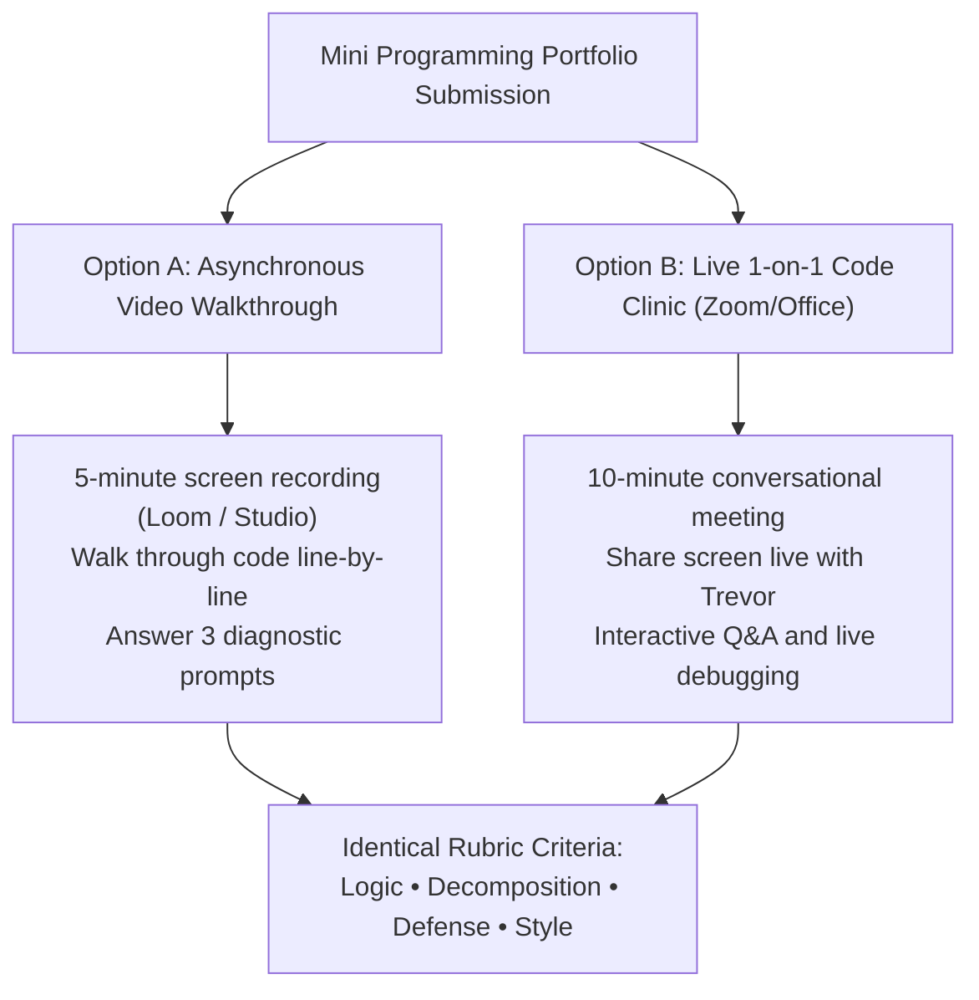

# Artifact 2.1: Mini Programming Portfolio Assignment Prompt

> **Courses:** COSC 1010 (Intro to CS), COSC 1030 (Computer Science I), COSC 2409 (Python)  
> **Instructor:** Trevor Swarm  
> **Modality:** Online Asynchronous & Hybrid  

---

## 1. What is a Mini Programming Portfolio?

In traditional programming classes, you are often evaluated by submitting code to an automated grading engine that checks whether your program produces exact text matches. If you miss a semicolon or extra space, the bot marks it zero. 

**We don’t do that here.** Real software engineering is about understanding how components fit together, explaining your logic, and defending your design choices. 

The **Mini Programming Portfolio** is your opportunity to compile, polish, and present 3 to 4 substantial programming exercises you have developed over the past month. Rather than a high-stakes exam, this is a portfolio review where you demonstrate mastery through **your choice of presentation format**.

---

## 2. Assessment Modality: Choose Your Pathway

You may choose whichever evaluation modality best matches your schedule, learning style, and communication preferences:

### Option A: Asynchronous Screen-Share Walkthrough
* Record a 5-to-7 minute video using Loom, Canvas Studio, or Zoom.
* Share your screen, open your code in your preferred editor (VS Code, PyCharm, etc.), run the program, and explain your logical architecture.
* Answer the three diagnostic questions assigned to your portfolio milestone.

### Option B: Live 1-on-1 Virtual Code Clinic
* Book a 10-minute appointment via the scheduler during portfolio week.
* Share your screen with Trevor live. Walk through your implementation, discuss alternative solutions, and receive immediate coaching.

---

## 3. Allowed Resources & Collaboration Boundaries

* **Encouraged:** You are strongly encouraged to collaborate with peers, consult documentation, utilize Google, and experiment with AI coding tools (e.g. ChatGPT, GitHub Copilot).
* **The Rule of Defense:** If you include a line of code or an algorithm in your portfolio, **you must be able to explain how it works in your own words.** If you cannot explain why a line exists, you do not yet own that knowledge.
