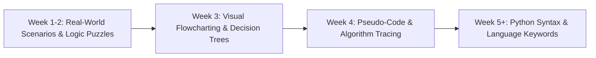

# Artifact 3.2: Meeting Students Where They Are: Modality & Curricular On-Ramps

> **Author:** Trevor Swarm  
> **Target Courses:** COSC 1010, COSC 2409, AIML 1010  

---

## 1. Modality Rework: Asynchronous Accessibility

To ensure asynchronous online students experience high-touch engagement comparable to in-person instruction, our computing courses were re-engineered around four core commitments:

1. **Bite-Sized Topical Videos:** Replaced long, hour-long passive recordings with short, 5-to-8 minute micro-lectures designed around single conceptual hurdles.
2. **Interactive Checkpoints:** Integrated low-stakes knowledge-check questions embedded directly into weekly Canvas modules, allowing students to verify their understanding before tackling coding assignments.
3. **Scaffolded PRIMM Exercises (Predict, Run, Inspect, Modify, Make):** Structured activities where students first observe and predict working code behavior before modifying it, preventing the blank-page syndrome that leads to student withdrawal.
4. **Instructional Design Feedback:** Integrated CET instructional design feedback regarding navigation menus, clear typographic hierarchy, and accessible color contrast.

---

## 2. Low-Barrier Visual On-Ramps (COSC 1010 & AIML 1010)

* **The Problem:** Non-traditional and first-generation learners often assume programming requires mathematical genius. If confronted with strict syntax errors on day one, they quickly conclude they don't belong.
* **The Solution:** We begin the semester with "No-Code" logic exercises:
  * Deconstructing everyday systems (e.g. traffic light sequencing, ATM transactions, coffee brewing logic).
  * Constructing visual flowcharts to represent conditionals and loops.
  * Building algorithmic confidence before introducing curly braces, indents, or compile commands.

---

## 3. High-Touch Instructor Availability & Normalizing Mistakes

* **On-Demand Virtual Office Hours:** Holding scheduled office hours while accommodating asynchronous students through flexible evening and weekend Zoom requests.
* **Normalizing Coding Bugs:** Publicly demonstrating that syntax errors are normal diagnostic feedback rather than personal deficiencies.
* **Advanced Extensions:** Providing optional extension units (game development, neural network demos) for students who work ahead, while preserving office hours for targeted one-on-one coaching for struggling learners.
