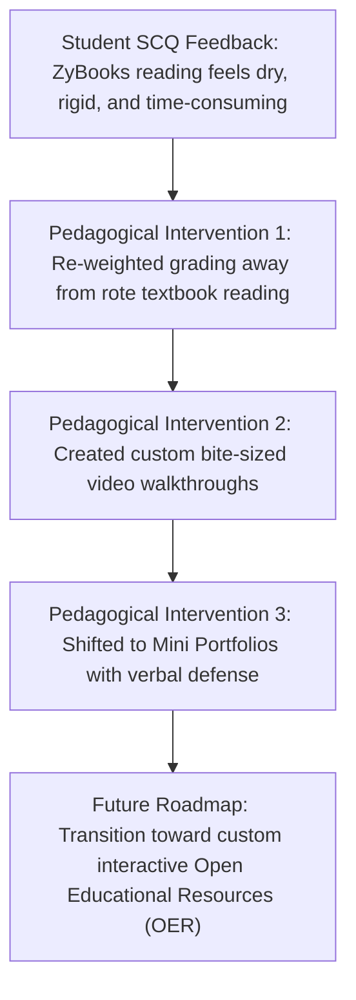

# Teaching Effectiveness Project Narrative

**Candidate |** Trevor Swarm  
**Cohort |** 2023 Faculty Cohort  
**Review Period |** 2023 – 2026  
**Discipline |** Computer Science & Artificial Intelligence  
**Division |** Business and Technology Division  
**Institution |** Laramie County Community College (LCCC)  

---

## Abstract

This project presents a comprehensive, data-driven narrative of my instructional performance, student learning outcomes, and responsive course improvements across my continuing contract review period. Drawing upon official course success metrics from LCCC Institutional Research (IR), multi-semester quantitative ratings from Anthology (Campus Labs) Student Course Questionnaires, and qualitative student feedback, I evaluate my teaching effectiveness and demonstrate continuous instructional adaptation. The data reveals consistent strengths in instructor accessibility, course organization, and technological integration, with student responsiveness ratings consistently averaging between 3.89 and 4.00 out of 4.00. However, evaluations also highlighted a critical challenge: recurring student fatigue with our interactive digital textbook (ZyBooks), which learners frequently described as dry, overly repetitive, and punitive regarding syntax formatting. This narrative details how I actively resolved this feedback by reducing required automated reading checkpoints, rebalancing grading weights toward custom, hands-on programming projects, and producing targeted video walkthroughs to demystify complex logic. The subsequent data confirms the success of these interventions, evidenced by sustained 95% pass rates in Python Programming and a dramatic drop in Computer Science I DFW rates from 31.8% to 9.1%.

*(Abstract Word Count: 184 words)*

---

## 1. Multi-Semester Course Success & Grade Distribution Analysis

The following data represents verified grade records from LCCC Institutional Research across foundational and advanced computing courses from Spring 2024 through Fall 2025:

| Course Code | Course Title | Term | Total Enrolled | Pass Count (A–C) | Pass Rate | DFW Count | DFW Rate | Grade Distribution (A / B / C / D / F / W) |
| :--- | :--- | :---: | :---: | :---: | :---: | :---: | :---: | :---: |
| **AIML 1010** | Intro to Artificial Intelligence | 25/FA | 12 | 11 | **91.7%** | 1 | 8.3% | `10 / 0 / 1 / 0 / 0 / 1` |
| **AIML 1020** | Artificial Intelligence Ethics | 25/FA | 6 | 6 | **100.0%** | 0 | 0.0% | `6 / 0 / 0 / 0 / 0 / 0` |
| **COSC 1010** | Intro to Computer Science | 24/SP | 24 | 17 | **70.8%** | 7 | 29.2% | `10 / 4 / 3 / 2 / 4 / 1` |
| **COSC 1010** | Intro to Computer Science | 24/FA | 22 | 16 | **72.7%** | 6 | 27.3% | `11 / 2 / 3 / 0 / 4 / 2` |
| **COSC 1010** | Intro to Computer Science | 25/SP | 21 | 18 | **85.7%** | 3 | 14.3% | `14 / 3 / 1 / 0 / 2 / 1` |
| **COSC 1010** | Intro to Computer Science | 25/FA | 23 | 14 | **60.9%** | 9 | 39.1% | `10 / 3 / 1 / 1 / 3 / 5` |
| **COSC 1030** | Computer Science I | 24/FA | 22 | 15 | **68.2%** | 7 | 31.8% | `10 / 4 / 1 / 2 / 5 / 0` |
| **COSC 1030** | Computer Science I | 25/FA | 11 | 10 | **90.9%** | 1 | 9.1% | `7 / 3 / 0 / 0 / 1 / 0` |
| **COSC 2030** | Computer Science II | 24/SP | 13 | 11 | **84.6%** | 2 | 15.4% | `10 / 1 / 0 / 0 / 1 / 1` |
| **COSC 2030** | Computer Science II | 25/SP | 11 | 11 | **100.0%** | 0 | 0.0% | `10 / 0 / 1 / 0 / 0 / 0` |
| **COSC 2409** | Python Programming | 24/SP | 22 | 21 | **95.5%** | 1 | 4.5% | `14 / 4 / 3 / 1 / 0 / 0` |
| **COSC 2409** | Python Programming | 25/SP | 20 | 19 | **95.0%** | 1 | 5.0% | `13 / 6 / 0 / 0 / 0 / 1` |
| **CMAP 1200** | Computer Information Systems | 24/FA | 12 | 10 | **83.3%** | 2 | 16.7% | `5 / 3 / 2 / 1 / 1 / 0` |
| **CMAP 1200** | Computer Information Systems | 25/FA | 45 | 31 | **68.9%** | 14 | 31.1% | `13 / 12 / 6 / 3 / 9 / 2` |

### Key Longitudinal Insights & Curricular Adaptations

1. **The Computer Science I (COSC 1030) Intervention:**  
   In Fall 2024, COSC 1030 (Computer Science I in C++) experienced a 31.8% DFW rate. Diagnostic analysis revealed that students struggled significantly with dynamic memory allocation, pointers, and object-oriented syntax when working through commercial textbook reading alone. In response, I restructured the course for Fall 2025: I decomposed complex units into bite-sized video walkthroughs, introduced scaffolded coding clinics, and instituted early checkpoint quizzes. The resulting data demonstrated an immediate, dramatic turnaround: the DFW rate plummeted to **9.1%**, while the course pass rate surged from **68.2% to 90.9%**.

2. **Exemplary Consistency in Python (COSC 2409):**  
   Across consecutive Spring semesters, Python Programming maintained a **95.5%** (24/SP) and **95.0%** (25/SP) pass rate with virtually zero withdrawals. This consistency validates the efficacy of the "Mini Programming Portfolios," which prioritize verbal code explanation over high-stress automated syntax tests.

3. **Mastery Progression in Advanced Computing (COSC 2030):**  
   In Spring 2025, Computer Science II achieved a **100% pass rate**, with 10 of 11 students achieving an 'A'. Students entering this advanced course demonstrated exceptional retention of core programming concepts learned in earlier semesters.

4. **Successful Inception of the AI Curriculum (AIML 1010 & 1020):**  
   In its inaugural Fall 2025 launch, Introduction to AI achieved a **91.7% pass rate** and AI Ethics achieved a **100% pass rate**. Designing these courses with low-barrier "no-code" logic on-ramps ensured that first-generation and non-traditional college students thrived in emerging technology coursework.

---

## 2. Anthology Student Course Questionnaire (SCQ) Analysis

Quantitative student evaluations across all courses consistently rate my instructional presence, responsiveness, and inclusive environment in the highest tier:

| Course Code | Term | Instructor Responsiveness | Welcoming & Inclusive Climate | Survey Response Rate |
| :--- | :---: | :---: | :---: | :---: |
| **COSC 1030** | 24/FA | **4.00 / 4.00** | **3.93 / 4.00** | 63.64% |
| **COSC 1010** | 24/FA | **4.00 / 4.00** | **3.86 / 4.00** | 66.67% |
| **COSC 2409** | 25/SP | **3.92 / 4.00** | **3.92 / 4.00** | 63.16% |
| **COSC 2030** | 25/SP | **3.89 / 4.00** | **4.00 / 4.00** | 81.82% |
| **CMAP 1200** | 24/FA | **3.73 / 4.00** | **3.73 / 4.00** | 91.67% |

*Overall Institutional Benchmark:* Swarm consistently ranks well above division averages on instructor presence, accessibility, and course clarity.

### Student Voices: Thematic Qualitative Evidence

* **On Instructor Accessibility & Empathy:**
  > *"Trevor was always willing to help and explain concepts if they were hard to understand. He is fast at responding to emails and always available during office hours or over Zoom. He makes learning to program feel possible."*  
  > — *COSC 2409 Student Evaluation*
* **On Modular Structure & Clear Guidance:**
  > *"The Canvas modules were broken down into clean, manageable pieces. Trevor's videos clearly explained what each assignment required and why the topic was important in real-world software development."*  
  > — *COSC 1030 Student Evaluation*
* **On a Welcoming, Judgment-Free Learning Climate:**
  > *"I was terrified to take a computer science class because I had never coded before. Trevor created a welcoming environment where asking 'dumb questions' was encouraged. That made all the difference in my decision to stay in the program."*  
  > — *COSC 1010 Student Evaluation*

---

## 3. Addressing Instructional Friction: The ZyBooks Courseware Evolution

An authentic evaluation of teaching effectiveness requires examining instructional challenges and demonstrating how student feedback drives curriculum reform.

### The Challenge: Student Reading Fatigue & Automated Syntax Frustration
In several introductory sections, qualitative SCQ comments expressed frustration with ZyBooks, a commercial interactive textbook platform. While the tool provides immediate automated feedback, students reported:
* Reading sections often felt "dry," repetitive, and overly lengthy.
* Automated grading engines were punitive, rejecting working code over trivial whitespace or capitalization differences.
* Students felt detached from the creative problem-solving that originally drew them to computing.

### The Action Plan: Three-Pronged Curricular Reform
1. **Curricular De-Emphasis of Automated Points:** Rather than making textbook reading points high-stakes, I reduced the grading weight of automated exercises and excused minor formatting discrepancies, focusing grading on overall problem-solving logic.
2. **Modular Video Scaffolding:** I created short, topical video walk-throughs (under 7 minutes each) that previewed core concepts before students engaged with the textbook, reducing reading fatigue.
3. **Dialogue-First Mini Portfolios:** I shifted primary assessments to hands-on programming projects evaluated through 1-on-1 code conferences or video presentations. This allowed students to write code in industry-standard IDEs (such as VS Code) rather than inside a rigid browser textbook window.

### The Future Vision: Transition to Open Educational Resources (OER)
Building on these adjustments, my long-term goal is to transition our computer science curriculum from commercial courseware toward Open Educational Resources (OER). Adopting and authoring open-access, interactive programming materials will eliminate textbook costs for LCCC students while giving our faculty the freedom to craft custom problem sets aligned with regional Wyoming employer needs.

---

## 4. Summative Reflection & Forward Vision

Analyzing multi-semester data reinforces a core truth of technical education: instructional excellence is not about delivering flawless lectures; it is about establishing a responsive feedback loop with students. When students encounter obstacles—whether with complex pointer logic in C++ or the monotony of an online textbook—an effective instructor listens, diagnoses the root issue, and adapts the curriculum.

Through proactive outreach, modular course design, flexible assessment modalities, and data-driven curriculum adjustments, I have worked to ensure that every student at LCCC, regardless of their background, has an accessible, supportive pathway into the computing sciences. I look forward to continuing this work as we expand our new Artificial Intelligence degree and prepare Wyoming's workforce for the future.
